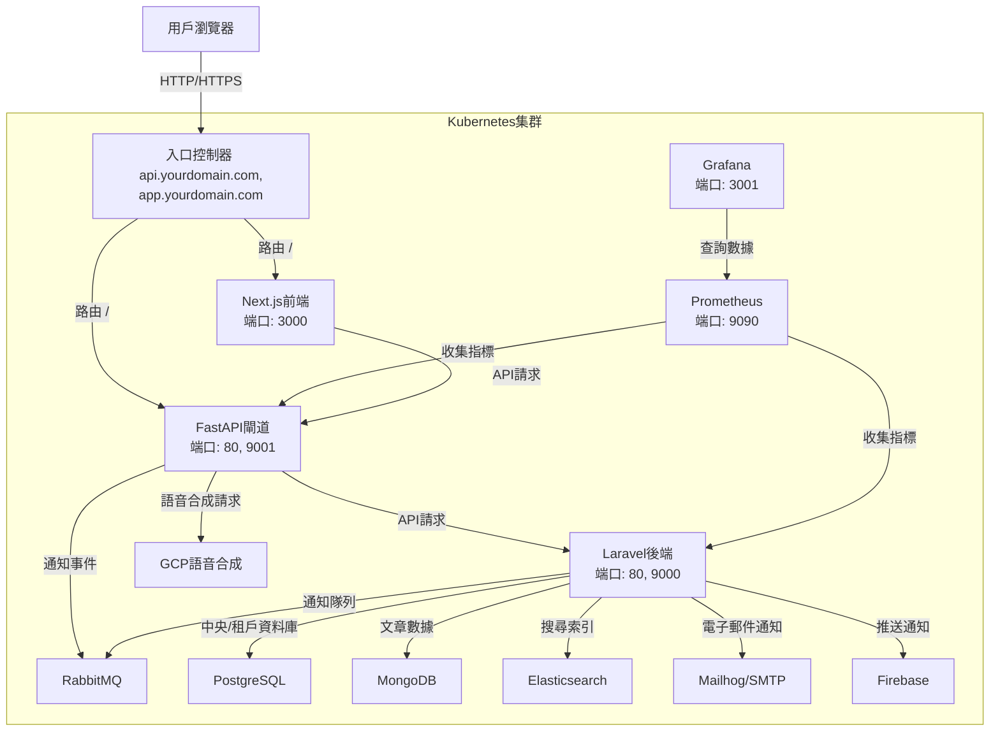

# OrbitPress CMS

OrbitPress 是一個專為媒體平台打造的多租戶內容管理系統（CMS），使用 **Laravel**、**FastAPI** 和 **Next.js** 構建，支援多語系內容管理、SEO 優化、RBAC 權限控制和自動化部署。核心功能包括靈活的文章審核流程（草稿、審核、發布）、高效搜尋（Elasticsearch）、版本控制（Spatie Snapshots）和即時監控（Prometheus + Grafana）。它適合需要高效內容管理和多品牌運營的媒體企業，具備高擴展性和 SaaS 潛力。

**注意**：本倉庫（https://github.com/BpsEason/OrbitPress.git）僅包含核心程式碼（例如自定義控制器、模型、前端頁面）。基本 Laravel 框架程式碼（例如 `app/Models/User.php`、路由檔案）和依賴（PHP、Python、Node.js 模組）需自行新增。請按照下方「初始化 Laravel 專案」和「安裝依賴」步驟完成設置。

## 常見問題解答（FAQ）

以下是一些關於 OrbitPress 的常見問題，涵蓋專案概述、技術選型、功能實現、部署流程和開發挑戰，幫助你快速了解並上手這個專案！

### 1. 什麼是 OrbitPress CMS？它的設計目標是什麼？

**答**：OrbitPress 是一個為媒體平台設計的多租戶 CMS，基於 Laravel（後端）、FastAPI（API 閘道）和 Next.js（前端），整合 PostgreSQL、MongoDB 和 Elasticsearch，提供多語系內容管理、SEO 優化、權限控制和自動化部署等功能。

**設計目標**：
- **多品牌運營**：透過多租戶架構，讓多個媒體品牌（如天下雜誌、康健雜誌）共用一套系統，降低運營成本。
- **高效內容管理**：提供草稿-審核-發布的工作流，結合版本控制，確保內容可追溯且易於管理。
- **高性能與擴展性**：使用微服務架構和 Elasticsearch，提升搜尋效率和系統擴展能力。
- **快速部署**：支援 Docker 和 Kubernetes，簡化本地開發和生產部署。

**解決的痛點**：
- 傳統 CMS 難以支援多品牌數據隔離。
- 缺乏靈活的內容審核流程和版本控制。
- 單體應用在高流量場景下的性能瓶頸。
- 部署流程複雜，環境一致性難保證。

### 2. 為什麼選擇 Laravel、FastAPI 和 Next.js？

**答**：
- **Laravel**：提供強大的 MVC 架構、Eloquent ORM 和 Artisan 工具，適合快速開發複雜業務邏輯。搭配 `Stancl\Tenancy` 和 `Spatie\Permission`，輕鬆實現多租戶和 RBAC。
- **FastAPI**：高性能（基於 Starlette 和 Pydantic），支援自動生成 API 文檔（Swagger），適合作為 API 閘道處理高併發請求，並方便整合 Python 生態的 AI/ML 服務（如 GCP TTS）。
- **Next.js**：支援伺服器端渲染（SSR）和增量靜態生成（ISR），對 SEO 友好，結合 `next-i18next` 實現多語系前端，適合打造現代化用戶界面。

### 3. 多租戶架構如何實現？如何保證數據隔離？

**答**：我們使用 `Stancl\Tenancy` 實現多租戶架構，每個租戶擁有獨立的 PostgreSQL 資料庫（或 Schema）。當請求進入系統時，`InitializeTenancy` 中間件根據請求頭（如 `X-Tenant-ID`）動態切換資料庫連接，確保數據隔離。MongoDB 透過 `tenant_id` 字段過濾數據，Elasticsearch 為每個租戶創建獨立索引（如 `articles_tenantId`），進一步強化隔離和搜尋效率。

**優勢**：
- 數據安全：租戶數據完全隔離，互不干擾。
- 性能優化：避免在查詢中頻繁使用 `WHERE tenant_id = X`。
- 靈活性：支援快速新增租戶，適合 SaaS 模式。

### 4. Laravel、FastAPI 和 Next.js 如何協同工作？API 閘道有什麼作用？

**答**：
- **Next.js ↔ FastAPI**：前端透過 HTTP/REST 請求與 FastAPI 閘道通訊。
- **FastAPI ↔ Laravel**：FastAPI 作為統一入口，將請求代理轉發給 Laravel（透過 HTTP 或內部網路），並注入租戶資訊（如 `X-Tenant-ID`）。

**API 閘道（FastAPI）的作用**：
- **統一入口**：簡化前端與後端的通訊。
- **身份驗證**：處理 JWT 驗證，確保請求安全。
- **速率限制**：使用 `slowapi` 限制請求頻率，保護後端。
- **CORS 處理**：統一管理跨域請求。
- **協議轉換**：支援 REST 和 GraphQL 請求轉發。

### 5. 專案使用了哪些資料庫？它們的用途是什麼？

**答**：
- **PostgreSQL**：儲存核心業務數據（如用戶、租戶配置、權限），支援關聯查詢和事務，適合結構化數據。
- **MongoDB**：儲存非結構化文章內容和日誌，靈活應對內容結構變化，作為 PostgreSQL 的冗餘備份。
- **Elasticsearch**：用於全文搜尋和數據分析，提供高效的文章檢索和多語系分詞。

**選擇原因**：
- PostgreSQL 穩定且支援 JSONB，與 Laravel 高度兼容。
- MongoDB 適合靈活的文檔數據，易於擴展。
- Elasticsearch 提供極速搜尋和分詞能力，特別適合中文搜尋。

### 6. 內容審核流程如何實現？如何控制權限？

**答**：內容審核流程實現了「草稿 → 審核中 → 已發布」的工作流：
- **狀態機**：使用 `Spatie\Laravel-Model-States` 定義文章狀態（`Draft`、`Review`、`Published`）和轉換規則（如只能從 `Draft` 轉到 `Review`）。
- **權限控制（RBAC）**：透過 `Spatie\Permission` 定義細粒度權限（如 `publish_article`、`approve_article`）。`ArticlePolicy` 檢查操作權限，確保只有授權用戶能執行發布或審核。
- **審核日誌**：使用 `Spatie\Activitylog` 記錄每次狀態變更，便於追蹤。

例如，`ContentController::publish()` 方法實現了發布邏輯，詳見下方「關鍵程式碼」。

### 7. 如何實現多語系和 SEO 優化？

**答**：
- **多語系（i18n）**：
  - **後端**：使用 `spatie/laravel-translatable`，將文章標題和內容儲存為 JSON（如 `{"en": "Title", "zh_TW": "標題"}`），根據請求語言自動檢索。
  - **前端**：使用 `next-i18next`，根據 URL 或語言設定動態切換 UI 語言。
- **SEO 優化**：
  - Next.js 的 SSR/ISR 生成完整 HTML，提升搜尋引擎爬取效率。
  - 使用 `next/head` 動態生成 `<title>` 和 `<meta>` 標籤，確保每頁有獨特的 SEO 元數據。
  - 多租戶子網域（如 `cw.yourdomain.com`）增強品牌獨立性。

### 8. 如何實現版本控制和歷史記錄？

**答**：使用 `spatie/eloquent-snapshot` 實現文章版本控制：
- **快照儲存**：在文章更新時調用 `$article->saveSnapshot()`，儲存當前狀態到快照表。
- **歷史查看**：提供 `history()` API 端點，列出文章的所有快照。
- **版本恢復**：透過 `restore()` 方法（見下方程式碼），將文章還原到指定快照。
- **活動日誌**：使用 `Spatie\Activitylog` 記錄快照和還原操作，確保可追溯。

### 9. Elasticsearch 搜尋功能如何優化中文搜尋？

**答**：
- **欄位權重**：在 `multi_match` 查詢中，標題字段權重高於內容（如 `title^3`），提升搜尋相關性。
- **搜尋提示**：為標題配置 `completion` 數據類型，支援自動補全。
- **中文分詞**：使用 IK Analysis 插件進行中文分詞，創建索引時指定中文 `analyzer`，確保精確切分詞語。
- **多語系字段**：為每種語言創建獨立字段（如 `title.zh_TW`），根據用戶語言精準搜尋。

### 10. 如何確保 API 安全性和速率限制？

**答**：
- **身份驗證**：FastAPI 使用 JWT 驗證，Laravel 使用 `Sanctum` 生成和驗證 API Token。
- **權限控制**：`Spatie\Permission` 實現 RBAC，透過 `ArticlePolicy` 檢查操作權限。
- **速率限制**：
  - FastAPI 使用 `slowapi` 限制全局或端點請求。
  - Laravel 使用 `throttle:api` 中間件和自定義限制器（如 `tenant-publish`）。
- **輸入消毒**：`SanitizeInput` 中間件防止 XSS 攻擊。
- **HTTPS**：Kubernetes Ingress 整合 Cert-Manager 啟用 TLS。
- **錯誤追蹤**：Sentry 監控 API 錯誤並發送告警。

### 11. CI/CD 流程如何運作？有哪些安全措施？

**答**：
- **CI（持續集成）**：
  - 推送代碼到 `main` 或 `develop` 分支時，GitHub Actions 觸發。
  - 安裝依賴（Composer、Pip、Yarn），運行測試（PHPUnit、Pytest、Jest）。
  - 構建 Docker 映像，使用 Trivy 掃描漏洞。
- **CD（持續部署）**：
  - CI 成功後，將映像推送到容器註冊表，透過 `kubectl` 部署到 Kubernetes。
- **安全措施**：
  - **Trivy**：掃描 Docker 映像漏洞，若有高危漏洞則失敗。
  - **Dependabot**：自動檢測依賴漏洞並提交更新 PR。
  - **Secrets 管理**：使用 GitHub Secrets 儲存敏感資訊（如 API 金鑰）。

### 12. 租戶初始化如何實現「一鍵化」？

**答**：透過自定義 Artisan 命令 `tenants:create-full`：
- 創建租戶記錄（中央資料庫）。
- 初始化租戶上下文，切換到專屬資料庫。
- 執行資料庫遷移和種子（設置角色、權限、預設用戶）。
- 通知 FastAPI（透過 Webhook）執行閘道初始化。
- 使用單一命令完成所有步驟，簡化操作。

### 13. 專案開發中的主要挑戰是什麼？如何解決？

**答**：
- **挑戰 1：微服務通訊與數據一致性**
  - **問題**：在 Laravel、FastAPI 和多個資料庫間保持數據一致。
  - **解決方案**：使用 FastAPI 作為統一閘道，RabbitMQ 處理異步事件，PostgreSQL 儲存主數據，MongoDB 和 Elasticsearch 作為冗餘。
- **挑戰 2：多租戶數據隔離與性能**
  - **問題**：確保租戶數據隔離且不影響性能。
  - **解決方案**：使用 `Stancl\Tenancy` 實現資料庫隔離，Elasticsearch 使用租戶專屬索引，`InitializeTenancy` 中間件快速切換上下文。
- **挑戰 3：CI/CD 複雜性**
  - **問題**：管理多語言微服務的部署流程。
  - **解決方案**：GitHub Actions 分離管道，Docker 確保一致性，Trivy 和 Dependabot 增強安全。

### 14. 未來如何擴展 OrbitPress？

**答**：
- **服務網格**：引入 Istio/Linkerd，增強微服務通訊和可觀察性。
- **分佈式追蹤**：使用 Jaeger/OpenTelemetry 追蹤請求路徑。
- **AI/ML 整合**：新增文章摘要、推薦引擎等功能。
- **微前端**：支援多團隊獨立開發前端模塊。
- **數據分析**：整合數據湖（如 BigQuery）進行跨租戶分析。
- **災難恢復**：實現跨區域備份和高可用性。

## 系統架構

以下是 OrbitPress 的系統架構圖，使用中文標籤（避免圓括號）並優化以確保 Mermaid 渲染兼容，展示核心服務與外部服務的互動。



**說明**：
- **用戶瀏覽器**：透過入口控制器訪問前端或 API。
- **FastAPI閘道**：統一處理 API 請求、JWT 驗證和語音合成請求。
- **Laravel後端**：處理核心業務邏輯，存取多個資料庫。
- **Prometheus/Grafana**：監控服務性能，生成實時儀表板。

## 環境要求

- **Docker** 和 **Docker Compose**（本地開發）
- **Kubernetes**（生產環境，需 Cert-Manager 和 Ingress Controller）
- **Node.js**（v18+，Next.js）
- **PHP**（v8.2+，Laravel）
- **Python**（v3.10+，FastAPI）
- **資料庫**：PostgreSQL（v14+）、MongoDB（最新版）、Elasticsearch（v8.10.2）
- **服務**：RabbitMQ（v3.12）、Mailhog、Prometheus（v2.47.0）、Grafana（v10.1.5）

## 初始化 Laravel 專案

本倉庫僅包含核心程式碼，需初始化 Laravel 專案並整合：

1. **安裝 Laravel**：
   ```bash
   composer create-project laravel/laravel laravel
   cd laravel
   ```

2. **複製核心程式碼**：
   將倉庫的 `laravel/` 目錄（如 `app/Http/Controllers/Tenant/ContentController.php`）複製到新專案的 `laravel/app/`。

3. **創建路由檔案**：
   在 `laravel/routes/` 創建 `tenant.php`：
   ```php
   <?php
   use Illuminate\Support\Facades\Route;
   use App\Http\Controllers\Tenant\ContentController;

   Route::middleware(['auth:sanctum'])->group(function () {
       Route::post('/articles/{article}/publish', [ContentController::class, 'publish']);
       Route::post('/articles/{article}/restore/{snapshot}', [ContentController::class, 'restore']);
   });
   ```

4. **創建 .env 文件**：
   ```bash
   cp .env.example .env
   ```
   編輯 `.env`，添加以下變數：
   ```env
   APP_NAME=OrbitPress
   APP_ENV=local
   APP_KEY=
   APP_DEBUG=true
   APP_URL=http://localhost

   DB_CONNECTION=pgsql
   DB_HOST=postgres
   DB_PORT=5432
   DB_DATABASE=orbitpress
   DB_USERNAME=postgres
   DB_PASSWORD=secret

   MONGODB_CONNECTION=mongodb
   MONGODB_HOST=mongo
   MONGODB_PORT=27017
   MONGODB_DATABASE=orbitpress
   MONGODB_USERNAME=root
   MONGODB_PASSWORD=secret

   ELASTICSEARCH_HOST=elasticsearch:9200
   RABBITMQ_HOST=rabbitmq
   RABBITMQ_PORT=5672
   RABBITMQ_USER=guest
   RABBITMQ_PASSWORD=guest

   GCP_TTS_API_KEY=your_gcp_tts_api_key
   FIREBASE_SERVER_KEY=your_firebase_server_key
   JWT_SECRET_KEY=your_jwt_secret_key
   SENTRY_DSN=your_sentry_dsn
   GOOGLE_ANALYTICS_ID=your_ga_id
   ```

## 安裝依賴

需手動創建依賴配置文件並安裝：

### 1. Laravel（PHP 依賴）
編輯 `laravel/composer.json`：
```json
{
    "require": {
        "php": "^8.2",
        "laravel/framework": "^10.0",
        "stancl/tenancy": "^3.7",
        "spatie/laravel-permission": "^5.10",
        "spatie/laravel-activitylog": "^4.7",
        "spatie/laravel-model-states": "^2.4",
        "spatie/eloquent-snapshot": "^1.0",
        "laravel/socialite": "^5.6",
        "laravel/sanctum": "^3.2",
        "elasticsearch/elasticsearch": "^8.0",
        "mongodb/laravel-mongodb": "^4.0",
        "laravel-translatable/translatable": "^5.0"
    },
    "require-dev": {
        "phpunit/phpunit": "^10.0"
    }
}
```
安裝：
```bash
cd laravel
composer install
```

### 2. FastAPI（Python 依賴）
創建 `fastapi/requirements.txt`：
```text
fastapi==0.103.0
uvicorn==0.23.2
pydantic==2.4.2
requests==2.31.0
sentry-sdk==1.40.0
python-jose[cryptography]==3.3.0
```
安裝：
```bash
cd fastapi
pip install -r requirements.txt
```

### 3. Next.js（Node.js 依賴）
創建 `frontend/package.json`：
```json
{
    "dependencies": {
        "next": "^14.0.0",
        "react": "^18.2.0",
        "react-dom": "^18.2.0",
        "next-i18next": "^15.0.0"
    },
    "devDependencies": {
        "jest": "^29.5.0",
        "@testing-library/react": "^14.0.0",
        "@testing-library/jest-dom": "^5.16.5",
        "jest-environment-jsdom": "^29.5.0"
    }
}
```
安裝：
```bash
cd frontend
yarn install
```

## 安裝步驟

1. **複製專案**：
   ```bash
   git clone https://github.com/BpsEason/OrbitPress.git
   cd OrbitPress
   ```

2. **初始化 Laravel 專案並複製核心程式碼**：
   見「初始化 Laravel 專案」。

3. **創建 Docker Compose 配置**：
   在根目錄創建 `docker-compose.yml`（見上方範例）。

4. **構建並運行 Docker 容器**：
   ```bash
   docker-compose up --build -d
   ```

5. **生成 Laravel 應用程式金鑰**：
   ```bash
   docker exec -it orbitpress_laravel_app php artisan key:generate
   ```

6. **發布 Spatie Activitylog 配置**：
   ```bash
   docker exec -it orbitpress_laravel_app php artisan vendor:publish --provider="Spatie\Activitylog\ActivitylogServiceProvider" --tag="activitylog-config"
   ```

7. **運行系統資料庫遷移**：
   ```bash
   docker exec -it orbitpress_laravel_app php artisan migrate --force --path=database/migrations/system --database=pgsql
   docker exec -it orbitpress_laravel_app php artisan migrate --force --database=pgsql --path=vendor/spatie/laravel-activitylog/database/migrations
   ```

8. **創建新租戶**：
   ```bash
   docker exec -it orbitpress_laravel_app php artisan tenants:create-full mycompany "My Company" --domain=mycompany.localhost --data='{"publish_rate_limit": 10}'
   ```

9. **更新 RouteServiceProvider**：
   在 `laravel/app/Providers/RouteServiceProvider.php` 的 `boot` 方法添加：
   ```php
   public function boot()
   {
       $this->configureRateLimiting();
       $this->routes(function () {
           Route::middleware('api')
               ->prefix('api')
               ->group(base_path('routes/api.php'));
           Route::middleware('web')
               ->group(base_path('routes/web.php'));
           Route::middleware(['api', \App\Http\Middleware\InitializeTenancy::class])
               ->prefix('tenant-routes')
               ->group(base_path('routes/tenant.php'));
       });
   }
   ```
   確保導入 `Route`：
   ```php
   use Illuminate\Support\Facades\Route;
   ```

10. **添加環境變數驗證**：
    在 `laravel/public/index.php` 添加：
    ```php
    require __DIR__.'/../bootstrap/validate_env.php';
    ```
    創建 `laravel/bootstrap/validate_env.php`：
    ```php
    <?php
    if (!env('APP_KEY')) {
        throw new RuntimeException('Application key not set in .env file.');
    }
    ```

## 使用方法

- **前端訪問**：`http://localhost:3000`（Next.js，支援多語系）
- **API 閘道**：`http://localhost`（FastAPI）
- **Laravel 後端**：`http://localhost:8000`（透過 FastAPI 訪問）
- **MailHog UI**：`http://localhost:8025`
- **Prometheus UI**：`http://localhost:9090`
- **Grafana UI**：`http://localhost:3001`（用戶：admin，密碼：admin）

**運行測試**：
- Laravel：`docker exec -it orbitpress_laravel_app vendor/bin/phpunit`
- FastAPI：`docker exec -it orbitpress_fastapi_gateway pytest`
- Next.js：`docker exec -it orbitpress_frontend yarn test`

## Kubernetes 部署

1. **構建並推送 Docker 映像**：
   ```bash
   docker build -t your_registry/orbitpress-laravel:latest ./laravel
   docker build -t your_registry/orbitpress-fastapi:latest ./fastapi
   docker build -t your_registry/orbitpress-frontend:latest ./frontend
   docker push your_registry/orbitpress-laravel:latest
   docker push your_registry/orbitpress-fastapi:latest
   docker push your_registry/orbitpress-frontend:latest
   ```

2. **應用 Kubernetes 配置**：
   在 `k8s/` 目錄創建 `deployment.yaml`、`service.yaml` 和 `ingress.yaml`，然後：
   ```bash
   cd k8s
   kubectl apply -f deployment.yaml
   kubectl apply -f service.yaml
   kubectl apply -f ingress.yaml
   ```

3. **配置域名**：
   更新 `k8s/ingress.yaml` 中的 `api.yourdomain.com` 和 `app.yourdomain.com`，並配置 DNS。確保安裝 Cert-Manager 和 Ingress Controller（如 NGINX）。

4. **創建 Secrets 和 PVC**：
   為資料庫和監控數據創建 Kubernetes Secrets 和 PersistentVolumeClaims。

## 關鍵程式碼

以下展示 `laravel/app/Http/Controllers/Tenant/ContentController.php` 的核心方法，體現內容審核和版本控制功能。

### 1. `publish()` 方法
處理文章發布，檢查權限並觸發通知。

```php
/**
 * 發布指定的文章。
 */
public function publish(Article $article)
{
    // 檢查用戶是否有發布權限，確保 RBAC 控制
    $this->authorize('publish', $article);

    try {
        // 將文章狀態轉為 Published，使用狀態機管理
        $article->status->transitionTo(Published::class);
        // 設置發布時間
        $article->published_at = now();
        // 保存更新
        $article->save();

        // 觸發事件，通知 Email 或 Firebase 推送
        event(new \App\Events\ArticlePublished($article));
        // 記錄發布日誌，確保可追溯
        activity()
            ->performedOn($article)
            ->causedBy(auth()->user())
            ->event('published')
            ->log('文章 ' . $article->getTranslation('title', $article->locale) . ' 已發布。');
        // 記錄 Prometheus 指標
        Log::info('articles_published_total', ['tenant_id' => tenancy()->tenant->id]);
        // 返回成功響應
        return response()->json(['message' => '文章發布成功。']);
    } catch (InvalidTransition $e) {
        // 處理無效狀態轉換錯誤
        return response()->json(['error' => '無法發布文章: ' . $e->getMessage()], 400);
    }
}
```

**價值**：
- **狀態機**：確保狀態轉換邏輯正確。
- **事件驅動**：鬆耦合通知設計。
- **可追溯性**：日誌記錄便於審計。
- **監控**：Prometheus 指標追蹤發布次數。

### 2. `restore()` 方法
將文章還原到指定版本，支援誤操作恢復。

```php
/**
 * 恢復文章到特定版本。
 *
 * @param Article $article
 * @param \Spatie\EloquentSnapshot\Snapshot $snapshot
 * @return \Illuminate\Http\JsonResponse
 */
public function restore(Article $article, \Spatie\EloquentSnapshot\Snapshot $snapshot)
{
    // 檢查還原權限
    $this->authorize('restoreArticleVersion', $article);

    try {
        // 還原到指定快照
        $snapshot->restore();
        // 記錄還原日誌
        activity()
            ->performedOn($article)
            ->causedBy(auth()->user())
            ->event('restored')
            ->log('文章 ' . $article->getTranslation('title', $article->locale) . ' 已恢復到版本 ' . $snapshot->id . '。');
        // 返回成功響應
        return response()->json(['message' => '文章已成功恢復。']);
    } catch (\Exception $e) {
        // 處理還原錯誤
        return response()->json(['error' => '恢復文章失敗: ' . $e->getMessage()], 500);
    }
}
```

**價值**：
- **版本控制**：快照支援內容恢復。
- **權限控制**：RBAC 確保操作安全。
- **可追溯性**：日誌記錄增強審計能力。

## 貢獻

歡迎提交 Pull Request 或 Issue！步驟：
1. Fork 倉庫。
2. 創建特性分支（`git checkout -b feature/YourFeature`）。
3. 提交更改（`git commit -m 'Add YourFeature'`）。
4. 推送分支（`git push origin feature/YourFeature`）。
5. 創建 Pull Request。

## 授權

採用 MIT 授權，詳見 [LICENSE](LICENSE) 文件。
