# OrbitPress CMS

OrbitPress 是一個專為媒體平台設計的多租戶內容管理系統（CMS），採用現代化技術棧（**Laravel**、**FastAPI**、**Next.js**）打造，支援多語系內容管理、SEO 優化、RBAC 權限控制和自動化部署。核心功能包括靈活的文章審核流程（草稿、審核、發布）、高效搜尋（Elasticsearch）、版本控制（Spatie Snapshots）和即時監控（Prometheus + Grafana）。本專案適合需要高效內容管理和多品牌運營的媒體企業，具備高擴展性和 SaaS 模式潛力。

**重要說明**：本倉庫僅包含核心程式碼（例如自定義控制器、模型、前端頁面等）。基本 Laravel 框架程式碼（例如預設的 `app/Models/User.php`、路由檔案等）及相關依賴（PHP、Python、Node.js 模組）需自行新增。請按照下方「初始化 Laravel 專案」和「安裝依賴」步驟完成設置。

## 專案亮點

### 技術亮點
1. **多租戶架構與資料隔離**：基於 `Stancl\Tenancy`，實現租戶專屬資料庫（PostgreSQL）和 MongoDB 數據分離，Elasticsearch 提供高效搜尋，確保數據安全和隔離。
2. **現代化全棧整合**：結合 Laravel（業務邏輯）、FastAPI（API 閘道）和 Next.js（前端），支援多語系（i18n）與 SSR/ISR，提升 SEO 和用戶體驗。
3. **自動化部署與監控**：支援 Docker Compose 和 Kubernetes（包含 HPA 和 Ingress），整合 Prometheus 和 Grafana，提供即時性能監控和高可用性。

### 商業亮點
1. **靈活的內容管理與審核流程**：支援文章的草稿、審核、發布工作流，結合 RBAC（基於 `Spatie\Permission`）確保權限控制，適合多角色媒體團隊協作。
2. **多語系與 SEO 優化**：支援繁中、簡中、英文等多語系內容，Next.js 提供 SSR/ISR 快取，提升搜尋引擎排名，吸引全球用戶。
3. **可擴展的 SaaS 模式**：多租戶架構允許快速新增媒體品牌（如天下雜誌、康健雜誌），降低運營成本，支援快速市場擴張。

## 系統架構

以下是 OrbitPress 的系統架構圖，展示核心服務（Laravel、FastAPI、Next.js）與外部服務（PostgreSQL、MongoDB、Elasticsearch、GCP TTS、RabbitMQ、Prometheus、Grafana）的互動關係。

```mermaid
graph TD
  %% ========== 外部用戶與入口 ==========
  A[💻 User Browser] -->|HTTPS| B[🔗 Ingress Controller<br/>api.yourdomain.com / app.yourdomain.com]

  %% ========== Kubernetes Cluster ==========
  subgraph Kubernetes Cluster

    %% 前端與 API Gateway
    B -->|Path / | D[🌐 Next.js Frontend<br/>port: 3000]
    B -->|Path /api /graphql /tts | C[🚪 FastAPI Gateway<br/>port: 80, 9001]

    %% FastAPI 與後端系統整合
    C -->|🔁 API Proxy| E[🧱 Laravel Backend<br/>port: 80, 9000]
    C -->|🔊 Text-to-Speech| F[(🧠 GCP TTS API)]
    C -->|📨 Events| G[(📬 RabbitMQ)]

    %% Laravel 與資料層整合
    E -->|📘 Relational DB| H[(🗄️ PostgreSQL)]
    E -->|📚 Article Data| I[(🧾 MongoDB)]
    E -->|🔍 Search Index| J[(📦 Elasticsearch)]
    E -->|📧 Email| K[(📮 Mailhog / SMTP)]
    E -->|📲 Push| L[(🚀 Firebase FCM)]
    E -->|📨 Event Queue| G

    %% 觀測系統與指標追蹤
    M[📈 Prometheus<br/>port: 9090] -->|Collect Metrics| C
    M -->|Collect Metrics| E
    N[📊 Grafana<br/>port: 3001] -->|Dashboard| M
  end

  %% Next.js 與 FastAPI 閘道串接
  D -->|API Request| C
```



**說明**：
- **用戶** 透過 Ingress 訪問 FastAPI（API 閘道）或 Next.js（前端）。
- **FastAPI 閘道** 處理 API 路由、JWT 驗證、GCP TTS 請求，並與 Laravel 後端互動。
- **Laravel 後端** 負責核心業務邏輯，存取 PostgreSQL（租戶資料）、MongoDB（文章數據）、Elasticsearch（搜尋），並透過 RabbitMQ 處理通知。
- **Prometheus 和 Grafana** 監控 Laravel 和 FastAPI 的性能指標。

## 環境要求

- **Docker** 和 **Docker Compose**（本地開發）
- **Kubernetes**（生產環境，需安裝 Cert-Manager 和 Ingress Controller）
- **Node.js**（v18+，用於 Next.js）
- **PHP**（v8.2+，用於 Laravel）
- **Python**（v3.10+，用於 FastAPI）
- **資料庫**：PostgreSQL（v14+）、MongoDB（最新版）、Elasticsearch（v8.10.2）
- **其他服務**：RabbitMQ（v3.12）、Mailhog、Prometheus（v2.47.0）、Grafana（v10.1.5）

## 初始化 Laravel 專案

由於本倉庫僅包含核心程式碼（如自定義控制器和模型），你需要先初始化一個基本的 Laravel 專案，然後將核心程式碼整合進去。

1. **安裝 Laravel**：
   ```bash
   composer create-project laravel/laravel laravel
   cd laravel
   ```

2. **複製核心程式碼**：
   將倉庫中的 `laravel/` 目錄下的核心程式碼（例如 `app/Http/Controllers/Tenant/ContentController.php`）複製到新創建的 Laravel 專案的對應目錄（`laravel/app/`）。

3. **創建路由檔案**：
   在 `laravel/routes/` 目錄下，創建 `tenant.php`（用於租戶路由）並添加以下內容：
   ```php
   <?php
   use Illuminate\Support\Facades\Route;
   use App\Http\Controllers\Tenant\ContentController;

   Route::middleware(['auth:sanctum'])->group(function () {
       Route::post('/articles/{article}/publish', [ContentController::class, 'publish']);
       Route::post('/articles/{article}/restore/{snapshot}', [ContentController::class, 'restore']);
   });
   ```

4. **創建 .env 文件**：
   ```bash
   cp .env.example .env
   ```
   編輯 `.env`，添加以下必要的環境變數（根據你的需求調整）：
   ```env
   APP_NAME=OrbitPress
   APP_ENV=local
   APP_KEY=
   APP_DEBUG=true
   APP_URL=http://localhost

   DB_CONNECTION=pgsql
   DB_HOST=postgres
   DB_PORT=5432
   DB_DATABASE=orbitpress
   DB_USERNAME=postgres
   DB_PASSWORD=secret

   MONGODB_CONNECTION=mongodb
   MONGODB_HOST=mongo
   MONGODB_PORT=27017
   MONGODB_DATABASE=orbitpress
   MONGODB_USERNAME=root
   MONGODB_PASSWORD=secret

   ELASTICSEARCH_HOST=elasticsearch:9200
   RABBITMQ_HOST=rabbitmq
   RABBITMQ_PORT=5672
   RABBITMQ_USER=guest
   RABBITMQ_PASSWORD=guest

   GCP_TTS_API_KEY=your_gcp_tts_api_key
   FIREBASE_SERVER_KEY=your_firebase_server_key
   JWT_SECRET_KEY=your_jwt_secret_key
   SENTRY_DSN=your_sentry_dsn
   GOOGLE_ANALYTICS_ID=your_ga_id
   ```

## 安裝依賴

由於本倉庫不包含依賴配置文件，你需要手動創建並安裝以下依賴：

### 1. Laravel（PHP 依賴）
在 `laravel/` 目錄下，編輯 `composer.json`，添加以下依賴：

```json
{
    "require": {
        "php": "^8.2",
        "laravel/framework": "^10.0",
        "stancl/tenancy": "^3.7",
        "spatie/laravel-permission": "^5.10",
        "spatie/laravel-activitylog": "^4.7",
        "spatie/laravel-model-states": "^2.4",
        "spatie/eloquent-snapshot": "^1.0",
        "laravel/socialite": "^5.6",
        "laravel/sanctum": "^3.2",
        "elasticsearch/elasticsearch": "^8.0",
        "mongodb/laravel-mongodb": "^4.0",
        "laravel-translatable/translatable": "^5.0"
    },
    "require-dev": {
        "phpunit/phpunit": "^10.0"
    }
}
```

運行以下命令安裝：
```bash
cd laravel
composer install
```

### 2. FastAPI（Python 依賴）
在 `fastapi/` 目錄下，創建 `requirements.txt` 文件並添加以下內容：

```text
fastapi==0.103.0
uvicorn==0.23.2
pydantic==2.4.2
requests==2.31.0
sentry-sdk==1.40.0
python-jose[cryptography]==3.3.0
```

運行以下命令安裝：
```bash
cd fastapi
pip install -r requirements.txt
```

### 3. Next.js（Node.js 依賴）
在 `frontend/` 目錄下，創建 `package.json` 文件並添加以下內容：

```json
{
    "dependencies": {
        "next": "^14.0.0",
        "react": "^18.2.0",
        "react-dom": "^18.2.0",
        "next-i18next": "^15.0.0"
    },
    "devDependencies": {
        "jest": "^29.5.0",
        "@testing-library/react": "^14.0.0",
        "@testing-library/jest-dom": "^5.16.5",
        "jest-environment-jsdom": "^29.5.0"
    }
}
```

運行以下命令安裝：
```bash
cd frontend
yarn install
```

## 安裝步驟

1. **複製專案**：
   ```bash
   git clone https://github.com/BpsEason/OrbitPress.git
   cd OrbitPress
   ```

2. **初始化 Laravel 專案並複製核心程式碼**：
   如「初始化 Laravel 專案」部分所述，創建 Laravel 專案並複製核心程式碼。

3. **創建 Docker Compose 配置**：
   在專案根目錄下創建 `docker-compose.yml`，參考以下範例：
   ```yaml
   version: '3.8'
   services:
     laravel_app:
       build: ./laravel
       ports:
         - "8000:80"
       volumes:
         - ./laravel:/var/www/html
       depends_on:
         - postgres
         - mongo
         - elasticsearch
         - rabbitmq
     fastapi_gateway:
       build: ./fastapi
       ports:
         - "80:80"
         - "9001:9001"
       depends_on:
         - laravel_app
     frontend:
       build: ./frontend
       ports:
         - "3000:3000"
     postgres:
       image: postgres:14
       environment:
         POSTGRES_USER: postgres
         POSTGRES_PASSWORD: secret
         POSTGRES_DB: orbitpress
       ports:
         - "5432:5432"
     mongo:
       image: mongo:latest
       environment:
         MONGO_INITDB_ROOT_USERNAME: root
         MONGO_INITDB_ROOT_PASSWORD: secret
       ports:
         - "27017:27017"
     elasticsearch:
       image: elasticsearch:8.10.2
       environment:
         - discovery.type=single-node
       ports:
         - "9200:9200"
     rabbitmq:
       image: rabbitmq:3.12
       ports:
         - "5672:5672"
         - "15672:15672"
     mailhog:
       image: mailhog/mailhog
       ports:
         - "8025:8025"
     prometheus:
       image: prom/prometheus:v2.47.0
       ports:
         - "9090:9090"
     grafana:
       image: grafana/grafana:10.1.5
       ports:
         - "3001:3000"
   ```

4. **構建並運行 Docker 容器**：
   ```bash
   docker-compose up --build -d
   ```

5. **生成 Laravel 應用程式金鑰**：
   ```bash
   docker exec -it orbitpress_laravel_app php artisan key:generate
   ```

6. **發布 Spatie Activitylog 配置**：
   ```bash
   docker exec -it orbitpress_laravel_app php artisan vendor:publish --provider="Spatie\Activitylog\ActivitylogServiceProvider" --tag="activitylog-config"
   ```

7. **運行系統資料庫遷移**：
   ```bash
   docker exec -it orbitpress_laravel_app php artisan migrate --force --path=database/migrations/system --database=pgsql
   docker exec -it orbitpress_laravel_app php artisan migrate --force --database=pgsql --path=vendor/spatie/laravel-activitylog/database/migrations
   ```

8. **創建新租戶**：
   ```bash
   docker exec -it orbitpress_laravel_app php artisan tenants:create-full mycompany "My Company" --domain=mycompany.localhost --data='{"publish_rate_limit": 10}'
   ```

9. **更新 RouteServiceProvider**：
   在 `laravel/app/Providers/RouteServiceProvider.php` 的 `boot` 方法中添加租戶路由：
   ```php
   public function boot()
   {
       $this->configureRateLimiting();
       $this->routes(function () {
           Route::middleware('api')
               ->prefix('api')
               ->group(base_path('routes/api.php'));
           Route::middleware('web')
               ->group(base_path('routes/web.php'));
           Route::middleware(['api', \App\Http\Middleware\InitializeTenancy::class])
               ->prefix('tenant-routes')
               ->group(base_path('routes/tenant.php'));
       });
   }
   ```
   確保導入 `Route` facade：
   ```php
   use Illuminate\Support\Facades\Route;
   ```

10. **添加環境變數驗證**：
    在 `laravel/public/index.php` 開頭添加：
    ```php
    require __DIR__.'/../bootstrap/validate_env.php';
    ```
    並在 `laravel/bootstrap/` 目錄下創建 `validate_env.php`：
    ```php
    <?php
    if (!env('APP_KEY')) {
        throw new RuntimeException('Application key not set in .env file.');
    }
    ```

## 使用方法

- **前端訪問**：`http://localhost:3000`（Next.js，支援多語系和租戶切換）
- **API 閘道**：`http://localhost`（FastAPI，處理 API 請求）
- **Laravel 後端**：`http://localhost:8000`（透過 FastAPI 閘道訪問）
- **MailHog UI**：`http://localhost:8025`（查看測試電子郵件）
- **Prometheus UI**：`http://localhost:9090`
- **Grafana UI**：`http://localhost:3001`（預設用戶：admin，密碼：admin）

**運行測試**：
- Laravel：`docker exec -it orbitpress_laravel_app vendor/bin/phpunit`
- FastAPI：`docker exec -it orbitpress_fastapi_gateway pytest`
- Next.js：`docker exec -it orbitpress_frontend yarn test`

## Kubernetes 部署

1. **構建並推送 Docker 映像**：
   ```bash
   docker build -t your_registry/orbitpress-laravel:latest ./laravel
   docker build -t your_registry/orbitpress-fastapi:latest ./fastapi
   docker build -t your_registry/orbitpress-frontend:latest ./frontend
   docker push your_registry/orbitpress-laravel:latest
   docker push your_registry/orbitpress-fastapi:latest
   docker push your_registry/orbitpress-frontend:latest
   ```

2. **應用 Kubernetes 配置**：
   在 `k8s/` 目錄下創建 `deployment.yaml`、`service.yaml` 和 `ingress.yaml`，然後運行：
   ```bash
   cd k8s
   kubectl apply -f deployment.yaml
   kubectl apply -f service.yaml
   kubectl apply -f ingress.yaml
   ```

3. **配置域名**：
   更新 `k8s/ingress.yaml` 中的 `api.yourdomain.com` 和 `app.yourdomain.com`，並配置 DNS 解析。確保 Kubernetes 集群已安裝 Cert-Manager 和 Ingress Controller（如 NGINX）。

4. **創建 Secrets 和 PVC**：
   為資料庫（PostgreSQL、MongoDB、Elasticsearch）和監控數據（Prometheus、Grafana）創建 Kubernetes Secrets 和 PersistentVolumeClaims。

## 關鍵程式碼說明

以下展示 `laravel/app/Http/Controllers/Tenant/ContentController.php` 中的 `publish()` 和 `restore()` 方法，這些方法體現了 OrbitPress 的核心內容管理功能，包括狀態機、事件驅動和版本控制。

### 1. `publish()` 方法
此方法處理文章發布流程，檢查權限、轉換狀態並觸發通知事件，確保內容審核流程的嚴謹性。

```php
/**
 * 發布指定的文章。
 */
public function publish(Article $article)
{
    // 使用 Spatie\Permission 檢查用戶是否有發布權限，確保 RBAC 控制
    $this->authorize('publish', $article);

    try {
        // 使用 Spatie\ModelStates 將文章狀態轉換為 Published，實現狀態機管理
        $article->status->transitionTo(Published::class);
        // 設置發布時間為當前時間
        $article->published_at = now();
        // 保存文章更新
        $article->save();

        // 觸發 ArticlePublished 事件，通知 NotificationService 發送 Email 或 Firebase 推送
        event(new \App\Events\ArticlePublished($article));
        // 使用 Spatie\Activitylog 記錄發布活動，確保操作可追溯
        activity()
            ->performedOn($article)
            ->causedBy(auth()->user())
            ->event('published')
            ->log('文章 ' . $article->getTranslation('title', $article->locale) . ' 已發布。');
        // 記錄 Prometheus 指標，追蹤租戶的文章發布數量
        Log::info('articles_published_total', ['tenant_id' => tenancy()->tenant->id]);
        // 返回成功響應
        return response()->json(['message' => '文章發布成功。']);
    } catch (InvalidTransition $e) {
        // 捕獲無效狀態轉換錯誤（如從已發布狀態再次發布）
        return response()->json(['error' => '無法發布文章: ' . $e->getMessage()], 400);
    }
}
```

**價值**：
- **狀態機管理**：使用 `Spatie\ModelStates` 確保文章狀態（草稿、審核、發布）轉換的邏輯正確性。
- **事件驅動架構**：透過 `ArticlePublished` 事件觸發通知（如 Email 或 Firebase 推送），實現鬆耦合設計。
- **可追溯性**：結合 `Spatie\Activitylog` 記錄操作歷史，便於審計和問題排查。
- **監控整合**：記錄 Prometheus 指標，支援實時性能監控。

### 2. `restore()` 方法
此方法允許將文章還原到指定版本，展示版本控制和活動日誌的功能，適用於內容誤操作恢復場景。

```php
/**
 * 恢復文章到特定版本。
 *
 * @param Article $article
 * @param \Spatie\EloquentSnapshot\Snapshot $snapshot
 * @return \Illuminate\Http\JsonResponse
 */
public function restore(Article $article, \Spatie\EloquentSnapshot\Snapshot $snapshot)
{
    // 檢查用戶是否有還原文章版本的權限，確保僅授權用戶可操作
    $this->authorize('restoreArticleVersion', $article);

    try {
        // 使用 Spatie\EloquentSnapshot 還原文章到指定快照版本
        $snapshot->restore();
        // 記錄還原活動，手動觸發以補充快照不自動記錄的行為
        activity()
            ->performedOn($article)
            ->causedBy(auth()->user())
            ->event('restored')
            ->log('文章 ' . $article->getTranslation('title', $article->locale) . ' 已恢復到版本 ' . $snapshot->id . '。');
        // 返回成功響應
        return response()->json(['message' => '文章已成功恢復。']);
    } catch (\Exception $e) {
        // 捕獲還原過程中的任何錯誤，返回詳細錯誤信息
        return response()->json(['error' => '恢復文章失敗: ' . $e->getMessage()], 500);
    }
}
```

**價值**：
- **版本控制**：使用 `Spatie\EloquentSnapshot` 實現文章版本快照，支援內容恢復，增強 CMS 的穩健性。
- **權限控制**：透過 RBAC 確保僅授權用戶可執行還原操作，保障數據安全。
- **活動日誌**：記錄還原操作，確保所有更改可追溯，符合企業級 CMS 的審計需求。

## 貢獻

歡迎提交 Pull Request 或 Issue！請遵循以下步驟：
1. Fork 本倉庫。
2. 創建特性分支（`git checkout -b feature/YourFeature`）。
3. 提交更改（`git commit -m 'Add YourFeature'`）。
4. 推送分支（`git push origin feature/YourFeature`）。
5. 創建 Pull Request。

## 授權

本專案採用 MIT 授權。詳見 [LICENSE](LICENSE) 文件。
